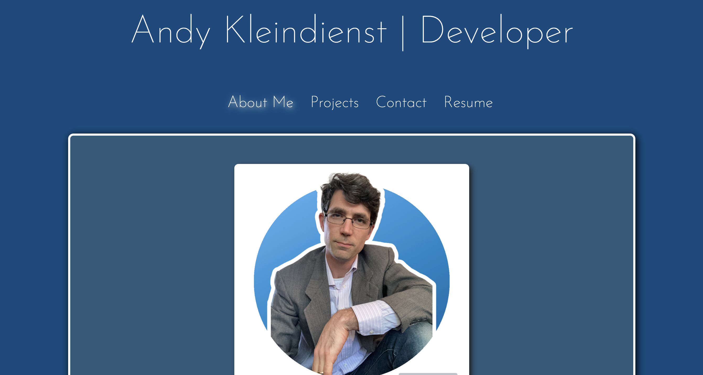

# developer-portfolio

## Description

Enjoy this portfolio of the development projects of Andy Kleindienst!

## Table of Contents

1. [Installing Dependencies](#installing-dependencies)
2. [Usage](#usage)
3. [Contributing](#contributing)
4. [Testing](#testing)
5. [Reporting Errors](#reporting-errors)
6. [License](#license)
7. [Questions](#questions)

## Installing Dependencies

npm install

## Usage

Please enjoy the page

## Contributing

This repo is not accepting contributions

## Testing

There are currently no tests for this app.

## Reporting Errors

Please report errors to andy.kleindienst@gmail.com

## License

MIT License

## Questions

For any questions regarding this project, please send correspondence to andy.kleindienst@gmail.com.

Please visit my profile on [GitHub](https://github.com/andykb9b13).
